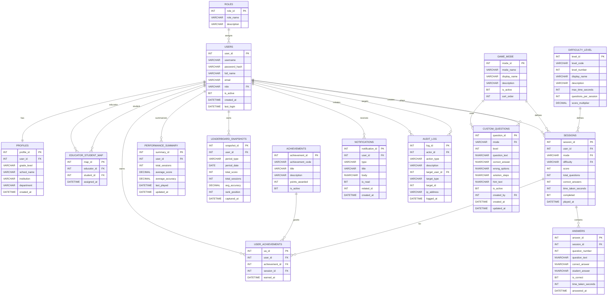

# MathGameApp Database ERD

```mermaid
erDiagram
    ROLES {
        INT role_id PK
        VARCHAR role_name
        VARCHAR description
    }
    USERS {
        INT user_id PK
        VARCHAR username
        VARCHAR password_hash
        VARCHAR full_name
        VARCHAR email
        VARCHAR role FK
        BIT is_active
        DATETIME created_at
        DATETIME last_login
    }
    PROFILES {
        INT profile_id PK
        INT user_id FK
        VARCHAR grade_level
        VARCHAR school_name
        VARCHAR institution
        VARCHAR department
        DATETIME created_at
    }
    EDUCATOR_STUDENT_MAP {
        INT map_id PK
        INT educator_id FK
        INT student_id FK
        DATETIME assigned_at
    }
    GAME_MODE {
        INT mode_id PK
        VARCHAR mode_name
        VARCHAR display_name
        VARCHAR description
        BIT is_active
        INT sort_order
    }
    DIFFICULTY_LEVEL {
        INT level_id PK
        VARCHAR level_code
        INT level_number
        VARCHAR display_name
        VARCHAR description
        INT max_time_seconds
        INT questions_per_session
        DECIMAL score_multiplier
    }
    SESSIONS {
        INT session_id PK
        INT user_id FK
        VARCHAR mode FK
        VARCHAR difficulty FK
        INT score
        INT total_questions
        INT correct_answers
        INT time_taken_seconds
        BIT completed
        DATETIME played_at
    }
    ANSWERS {
        INT answer_id PK
        INT session_id FK
        INT question_number
        NVARCHAR question_text
        NVARCHAR correct_answer
        NVARCHAR student_answer
        BIT is_correct
        INT time_taken_seconds
        DATETIME answered_at
    }
    PERFORMANCE_SUMMARY {
        INT summary_id PK
        INT user_id FK
        INT total_sessions
        DECIMAL average_score
        DECIMAL average_accuracy
        DATETIME last_played
        DATETIME updated_at
    }
    LEADERBOARD_SNAPSHOTS {
        INT snapshot_id PK
        INT user_id FK
        VARCHAR period_type
        DATE period_date
        INT total_score
        INT total_sessions
        DECIMAL avg_accuracy
        INT rank_position
        DATETIME captured_at
    }
    ACHIEVEMENTS {
        INT achievement_id PK
        VARCHAR achievement_code
        VARCHAR title
        VARCHAR description
        INT points_awarded
        BIT is_active
    }
    USER_ACHIEVEMENTS {
        INT ua_id PK
        INT user_id FK
        INT achievement_id FK
        INT session_id FK
        DATETIME earned_at
    }
    NOTIFICATIONS {
        INT notification_id PK
        INT user_id FK
        VARCHAR type
        VARCHAR title
        NVARCHAR body
        BIT is_read
        INT related_id
        DATETIME created_at
    }
    AUDIT_LOG {
        INT log_id PK
        INT actor_id FK
        VARCHAR action_type
        VARCHAR description
        INT target_user_id FK
        VARCHAR target_type
        INT target_id
        VARCHAR ip_address
        DATETIME logged_at
    }
    CUSTOM_QUESTIONS {
        INT question_id PK
        VARCHAR mode FK
        INT level
        NVARCHAR question_text
        NVARCHAR correct_answer
        NVARCHAR wrong_options
        NVARCHAR solution_steps
        NVARCHAR hint_text
        BIT is_active
        INT created_by FK
        DATETIME created_at
        DATETIME updated_at
    }

    ROLES ||--o{ USERS : "assigns"
    USERS ||--|| PROFILES : "has"
    USERS ||--o{ EDUCATOR_STUDENT_MAP : "educator"
    USERS ||--o{ EDUCATOR_STUDENT_MAP : "student"
    USERS ||--o{ SESSIONS : "plays"
    GAME_MODE ||--o{ SESSIONS : "defines"
    DIFFICULTY_LEVEL ||--o{ SESSIONS : "defines"
    SESSIONS ||--o{ ANSWERS : "contains"
    USERS ||--o{ PERFORMANCE_SUMMARY : "summarizes"
    USERS ||--o{ LEADERBOARD_SNAPSHOTS : "owns"
    USERS ||--o{ USER_ACHIEVEMENTS : "earns"
    ACHIEVEMENTS ||--o{ USER_ACHIEVEMENTS : "grants"
    SESSIONS ||--o{ USER_ACHIEVEMENTS : "for"
    USERS ||--o{ NOTIFICATIONS : "receives"
    USERS ||--o{ AUDIT_LOG : "initiates"
    USERS ||--o{ AUDIT_LOG : "targets"
    GAME_MODE ||--o{ CUSTOM_QUESTIONS : "uses"
    USERS ||--o{ CUSTOM_QUESTIONS : "creates"
```
