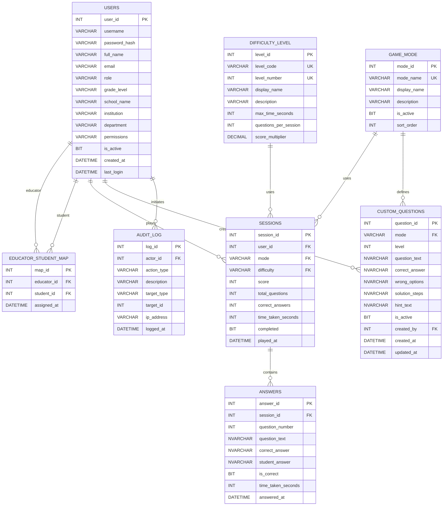

## MathGameApp ERD Guide Agent

### Overview
MathGameApp is a gamified math learning platform with role-based user management (students, educators, admins), 3 game modes (Computational, Algebra, Binary), 5 difficulty levels, session tracking, answer analytics, and custom question creation.

---

## Step-by-Step ERD Breakdown

### STEP 1: Core User System

#### Entity: `users` (PRIMARY KEY: `user_id`)
**Purpose:** Central user repository for all roles (student, educator, admin)

**Attributes:**
- `user_id` (INT, IDENTITY) — Unique identifier (Primary Key)
- `username` (VARCHAR 50) — Unique login identifier
- `password_hash` (VARCHAR 255) — Hashed password
- `full_name` (VARCHAR 100) — User's full name
- `email` (VARCHAR 100) — Unique email address
- `role` (VARCHAR 20) — One of: `student`, `educator`, `admin`
- `grade_level` (VARCHAR 50) — Grade/class level (e.g., "10", "College")
- `school_name` (VARCHAR 100) — School affiliation
- `institution` (VARCHAR 100) — University/organization
- `department` (VARCHAR 100) — Department/division
- `permissions` (VARCHAR 200) — Custom permission string
- `is_active` (BIT) — Account status (1=active, 0=inactive)
- `created_at` (DATETIME) — Account creation timestamp
- `last_login` (DATETIME) — Last login timestamp

**Key Point:** This single table supports all three roles. Role-based features are enforced at the application layer via middleware.

---

### STEP 2: Educator-Student Relationship

#### Entity: `educator_student_map` (PRIMARY KEY: `map_id`)
**Purpose:** Link educators to their students (Many-to-Many relationship)

**Attributes:**
- `map_id` (INT, IDENTITY) — Unique mapping identifier (Primary Key)
- `educator_id` (INT) — Foreign Key → `users.user_id`
- `student_id` (INT) — Foreign Key → `users.user_id`
- `assigned_at` (DATETIME) — When assignment occurred
- **UNIQUE Constraint:** `(educator_id, student_id)` — Prevents duplicate assignments

**Relationship: Many-to-Many**
- **One educator** has **many students**
- **One student** has **many educators**
- **Cardinality:** `educators (1) ------ (M) students`
- **Notation:** EDUCATORS: 1 |—◯ M:EDUCATOR_STUDENT_MAP |—◯ M:STUDENTS

**Foreign Key Actions:**
- `ON DELETE NO ACTION` — Prevents accidental deletion of active users in mappings

**Example:**
```
Educator: Mrs. Smith (user_id=2)
Students assigned to her: Alice (user_id=10), Bob (user_id=11), Carol (user_id=12)

educator_student_map:
  map_id=1: educator_id=2, student_id=10, assigned_at='2024-01-10'
  map_id=2: educator_id=2, student_id=11, assigned_at='2024-01-10'
  map_id=3: educator_id=2, student_id=12, assigned_at='2024-01-15'
```

---

### STEP 3: Game Configuration

#### Entity: `game_mode` (PRIMARY KEY: `mode_id`)
**Purpose:** Define available game modes (Computational, Algebra, Binary)

**Attributes:**
- `mode_id` (INT, IDENTITY) — Unique mode identifier (Primary Key)
- `mode_name` (VARCHAR 30, UNIQUE) — Slug: `computational`, `algebra`, `binary`
- `display_name` (VARCHAR 60) — User-friendly name (e.g., "Computational Math")
- `description` (VARCHAR 300) — Mode explanation
- `is_active` (BIT) — 1=active, 0=retired/hidden
- `sort_order` (INT) — Display order in UI

**Attributes:**
- `level_id` (INT, IDENTITY) — Unique level identifier (Primary Key)
- `level_code` (VARCHAR 10, UNIQUE) — Code: `level1`, `level2`, ..., `level5`
- `level_number` (INT, UNIQUE) — Numeric level (1–5)
- `display_name` (VARCHAR 20) — "Level 1", "Level 2", etc.
- `description` (VARCHAR 200) — Difficulty description
- `max_time_seconds` (INT) — Time limit (90s for Level 1, down to 30s for Level 5)
- `questions_per_session` (INT) — Questions asked (10–15)
- `score_multiplier` (DECIMAL 4,2) — Score multiplier (1.00 for Level 1, up to 2.00 for Level 5)

**Seeded Data:**
```
Level 1: 90 seconds, 10 questions, 1.00x multiplier
Level 2: 75 seconds, 10 questions, 1.20x multiplier
Level 3: 60 seconds, 10 questions, 1.50x multiplier
Level 4: 45 seconds, 12 questions, 1.80x multiplier
Level 5: 30 seconds, 15 questions, 2.00x multiplier
```

**Relationship: One-to-Many (1:M)**
- **One game mode** is used in **many sessions**
- **One difficulty level** is used in **many sessions**

---

### STEP 4: Game Sessions

#### Entity: `sessions` (PRIMARY KEY: `session_id`)
**Purpose:** Record each student's game session (who played what, when, and how well)

**Attributes:**
- `session_id` (INT, IDENTITY) — Unique session identifier (Primary Key)
- `user_id` (INT) — Foreign Key → `users.user_id` (ON DELETE CASCADE)
- `mode` (VARCHAR 30) — Foreign Key → `game_mode.mode_name`
- `difficulty` (VARCHAR 10) — Foreign Key → `difficulty_level.level_code`
- `score` (INT) — Total session score
- `total_questions` (INT) — Number of questions in session
- `correct_answers` (INT) — Number of correct answers
- `time_taken_seconds` (INT) — Total session duration
- `completed` (BIT) — 1=fully completed, 0=abandoned/timed-out
- `played_at` (DATETIME) — Session start timestamp

**Indexes:**
- `IX_sessions_user_id` — Fast lookup by student
- `IX_sessions_played_at DESC` — Chronological queries
- `IX_sessions_mode` — Filter by game mode

**Relationships:**
1. **users → sessions** (1:M) — One student plays many sessions
2. **game_mode → sessions** (1:M) — One mode has many sessions
3. **difficulty_level → sessions** (1:M) — One level has many sessions

**Foreign Key Actions:**
- `ON DELETE CASCADE` — When student is deleted, all their sessions are deleted

**Example:**
```
Session: session_id=101
  user_id=10 (Alice)
  mode='computational'
  difficulty='level2'
  score=750
  total_questions=10
  correct_answers=9
  time_taken_seconds=45
  completed=1
  played_at='2024-01-15 10:30:00'
```

---

### STEP 5: Answer Details

#### Entity: `answers` (PRIMARY KEY: `answer_id`)
**Purpose:** Store individual question answers within a session for detailed analytics

**Attributes:**
- `answer_id` (INT, IDENTITY) — Unique answer record (Primary Key)
- `session_id` (INT) — Foreign Key → `sessions.session_id` (ON DELETE CASCADE)
- `question_number` (INT) — Position in session (1–15)
- `question_text` (NVARCHAR MAX) — Full question text
- `correct_answer` (NVARCHAR 255) — Expected answer
- `student_answer` (NVARCHAR 255) — What student submitted (NULL if skipped)
- `is_correct` (BIT) — 1=correct, 0=incorrect/unanswered
- `time_taken_seconds` (INT) — Time spent on this question
- `answered_at` (DATETIME) — When student answered

**Index:**
- `IX_answers_session_id` — Fast lookup by session

**Relationship: One-to-Many (1:M)**
- **One session** has **many answers** (typically 10–15)
- **Cardinality:** SESSIONS: 1 |—◯ M:ANSWERS

**Foreign Key Actions:**
- `ON DELETE CASCADE` — When a session is deleted, all its answers are deleted

**Example:**
```
Session 101 answers:

Answer 1:
  question_text="What is 5 + 3?"
  correct_answer="8"
  student_answer="8"
  is_correct=1
  time_taken_seconds=3

Answer 2:
  question_text="What is 12 × 7?"
  correct_answer="84"
  student_answer="82"
  is_correct=0
  time_taken_seconds=8
```

---

### STEP 6: Custom Questions

#### Entity: `custom_questions` (PRIMARY KEY: `question_id`)
**Purpose:** Educator-created or admin-created custom questions for specific modes and levels

**Attributes:**
- `question_id` (INT, IDENTITY) — Unique question (Primary Key)
- `mode` (VARCHAR 30) — Foreign Key → `game_mode.mode_name`
- `level` (INT) — Difficulty level (1–5)
- `question_text` (NVARCHAR 500) — Question statement
- `correct_answer` (NVARCHAR 200) — Expected answer
- `wrong_options` (NVARCHAR 500) — Incorrect options (comma-separated or JSON)
- `solution_steps` (NVARCHAR 1000) — Teaching explanation
- `hint_text` (NVARCHAR 300) — Hint for students
- `is_active` (BIT) — 1=active, 0=retired/draft
- `created_by` (INT) — Foreign Key → `users.user_id` (who created it)
- `created_at` (DATETIME) — Creation timestamp
- `updated_at` (DATETIME) — Last modification

**Relationships:**
1. **game_mode → custom_questions** (1:M) — One mode has many custom questions
2. **users → custom_questions** (1:M) — One user creates many questions

**Foreign Key Actions:**
- `created_by` references `users.user_id` — Must be an admin or educator

**Example:**
```
Question: question_id=501
  mode='algebra'
  level=3
  question_text="Solve for x: 2x + 5 = 13"
  correct_answer="4"
  wrong_options="3,5,6"
  solution_steps="Step 1: 2x = 13 - 5 = 8; Step 2: x = 8 / 2 = 4"
  hint_text="Subtract 5 from both sides first"
  created_by=2 (Mrs. Smith, educator)
  created_at='2024-01-10 14:20:00'
```

---

### STEP 7: Audit Logging

#### Entity: `audit_log` (PRIMARY KEY: `log_id`)
**Purpose:** Track administrative and sensitive actions for compliance and security

**Attributes:**
- `log_id` (INT, IDENTITY) — Unique log entry (Primary Key)
- `actor_id` (INT) — Foreign Key → `users.user_id` (who performed the action)
- `action_type` (VARCHAR 100) — Type of action (e.g., `user_role_change`, `session_deleted`)
- `description` (VARCHAR 500) — Action details
- `target_type` (VARCHAR 50) — Entity being affected (e.g., `user`, `session`)
- `target_id` (INT) — ID of the affected entity
- `ip_address` (VARCHAR 45) — IP address of the actor
- `logged_at` (DATETIME) — Action timestamp

**Index:**
- `IX_audit_log_actor` — Fast lookup by actor and timestamp

**Relationship: Many-to-One (M:1)**
- **Many audit entries** reference **one actor**
- **Cardinality:** AUDIT_LOG: M |—◯ 1:USERS

**Example:**
```
Log: log_id=1001
  actor_id=1 (admin)
  action_type='user_role_change'
  description='Changed Alice (user_id=10) from student to educator'
  target_type='user'
  target_id=10
  ip_address='192.168.1.100'
  logged_at='2024-01-15 09:00:00'
```

---

## Complete Relationship Map

### Cardinality Legend
- `1 |—— M` = One-to-Many
- `1 |—— 1` = One-to-One
- `M |—— M` = Many-to-Many (through junction table)

### All Relationships

| From | Relationship | To | Type | Notes |
|------|---------------|----|------|-------|
| **users** | 1 |—— M | **educator_student_map** (educator) | Educator has many students |
| **users** | 1 |—— M | **educator_student_map** (student) | Student has many educators |
| **users** | 1 |—— M | **sessions** | Student plays many sessions |
| **users** | 1 |—— M | **custom_questions** | Educator/admin creates many questions |
| **users** | 1 |—— M | **audit_log** (actor) | User performs many actions |
| **game_mode** | 1 |—— M | **sessions** | Mode used in many sessions |
| **game_mode** | 1 |—— M | **custom_questions** | Mode has many custom questions |
| **difficulty_level** | 1 |—— M | **sessions** | Level used in many sessions |
| **sessions** | 1 |—— M | **answers** | Session has many answers (10–15) |

---

## Mermaid ERD Diagram



---

## Key Design Principles

1. **Single User Table with Role-Based Access** — All users (students, educators, admins) stored in one table; roles enforced by middleware
2. **Educator-Student Mapping** — Many-to-many relationship allows flexible class assignments
3. **Session-Answer Hierarchy** — Each session contains 10–15 answers; ON DELETE CASCADE keeps data integrity
4. **Game Configuration** — Lookup tables (game_mode, difficulty_level) make it easy to add/modify modes and levels without code changes
5. **Custom Questions** — Educators can author questions; linked to mode and level
6. **Audit Trail** — All admin actions logged for compliance and troubleshooting
7. **Referential Integrity** — Foreign keys with ON DELETE CASCADE for students; ON DELETE NO ACTION for user references in mappings

---

## When to Use This Guide

- **Onboarding developers** to the MathGameApp database schema
- **Adding new features** that interact with users, sessions, or questions
- **Optimizing queries** — understand table relationships before joining
- **Troubleshooting data issues** — trace a session back to its student, mode, and answers
- **Planning migrations** — understand impact of schema changes

---

## Example Queries Using These Relationships

### 1. Get all sessions for one student, with mode and difficulty info
```sql
SELECT s.session_id, s.played_at, gm.display_name AS mode, dl.display_name AS level, s.score, s.correct_answers
FROM sessions s
JOIN game_mode gm ON s.mode = gm.mode_name
JOIN difficulty_level dl ON s.difficulty = dl.level_code
WHERE s.user_id = 10
ORDER BY s.played_at DESC;
```

### 2. Get all students assigned to an educator
```sql
SELECT u.user_id, u.full_name, u.username
FROM users u
JOIN educator_student_map esm ON u.user_id = esm.student_id
WHERE esm.educator_id = 2;
```

### 3. Get answer details for a single session
```sql
SELECT a.question_number, a.question_text, a.correct_answer, a.student_answer, a.is_correct, a.time_taken_seconds
FROM answers a
WHERE a.session_id = 101
ORDER BY a.question_number;
```

### 4. Get all audit logs for a specific action type and date range
```sql
SELECT al.log_id, u.full_name, al.action_type, al.description, al.logged_at
FROM audit_log al
JOIN users u ON al.actor_id = u.user_id
WHERE al.action_type = 'user_role_change'
  AND al.logged_at >= '2024-01-01'
ORDER BY al.logged_at DESC;
```

---

## Tool Preferences
- Break down ERDs step-by-step for clarity
- Show primary keys (PK), foreign keys (FK), unique keys (UK)
- Explain cardinality with plain language + notation
- Provide real-world examples for each table
- Link all foreign keys to their source tables
- Include indexes and ON DELETE actions
